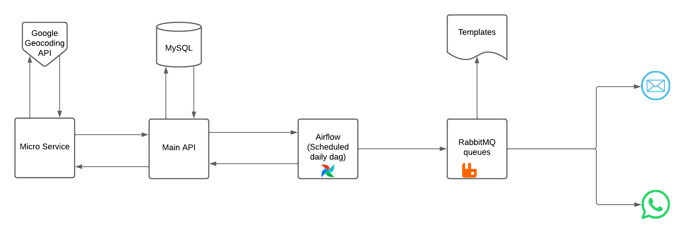

# Car Rental API

## Summary
* [Requirements](https://github.com/MatheusSC017/Rental-of-vehicles#requirements)
* [Structure](https://github.com/MatheusSC017/Rental-of-vehicles#structure)
* [Authentication](https://github.com/MatheusSC017/Rental-of-vehicles#authentication)
* [Installation](https://github.com/MatheusSC017/Rental-of-vehicles#installation)
  * [Quick install with Docker](https://github.com/MatheusSC017/Rental-of-vehicles#quick-install-with-docker)
  * [On-premises installation](https://github.com/MatheusSC017/Rental-of-vehicles#on-premises-installation)
  * [Enviroment files parameters](https://github.com/MatheusSC017/Rental-of-vehicles#enviroment-files-parameters)

## Requirements
* **Python 3.9**
* **MySQL**
* **Airflow**
* **RabbitMQ**

## Structure
Regarding the available endpoints, you can view them in the Swagger documentation at this [link](https://rental-of-vehicles-66128f353f24.herokuapp.com/ui/)

You can also view the list of endpoints made available by the API through the Swagger documentation stored in the documentation folder

## Authentication
Regarding the form of authentication accepted by the API, we have three ways of using it, the first is through basic authentication (Username and password), the second is through Token authentication that allows you to log in and create a token that can be used during requests and the third is Session Authentication, native to Django

## Installation
### Quick install with Docker

``
Until now, the messaging system is only available for installation on-premises, I intend to automate its installation with Docker in the next updates
``

#### Installation for Development mode
1. Clone the repository on your device

2. Move to the project repository

3. Create the .env.coordinates file, in this file configure the database and API information to the microservice (Guide yourself through the [environment variables](https://github.com/MatheusSC017/Rental-of-vehicles#enviroment-files-parameters) section)

4. Create the .env.rental file, in this file configure the database and API information to the main API (Guide yourself through the [environment variables](https://github.com/MatheusSC017/Rental-of-vehicles#enviroment-files-parameters) section)

5. Run the docker compose file to install the application in development mode, in this form, the basic settings have already been set and some initial data will be generated for you to test the API
> docker-compose up -d --build 

### On-premises installation
1. Clone the repository on your device
2. Go to the project directory
3. Create a virtual environment on your device
> python -m venv venv 

4. Run the virtual environment, if you are using the Windows operating system, use the following command
> venv/Scripts/activate

But if you use Linux OS or MAC use the command below
> source venv/bin/activate

5. Install the libraries saved in the requirements.txt file, if you are using the PIP package manager you can use the following command
> pip install -r RentalAPI/requirements.txt
> pip install -r CoordinatesAPI/requirements.txt

6. Create the .env.coordinates file, in this file configure the database and API information to the microservice (Guide yourself through the [environment variables](https://github.com/MatheusSC017/Rental-of-vehicles#enviroment-files-parameters) section)

7. Run the file to start the database 
> python CoordinatesAPI/init_db.py 

8. Run the file to create an access key to be used in the main API, copy the token printed in the terminal
> python CoordinatesAPI/create_access_token.py 

9. Run the microservice application
> flask --app CoordinatesAPI/address run

10. Create the .env.rental file, in this file configure the database and API information to the main API (Guide yourself through the [environment variables](https://github.com/MatheusSC017/Rental-of-vehicles#enviroment-files-parameters) section)

11. Create the database according to the settings established in the .env.rental file

12. Make sure you have mysql installed on your machine and create the “vehicle rental” table using the command below
> CREATE SCHEMA `rental-of-vehicles` DEFAULT CHARACTER SET utf8 COLLATE utf8_bin ;

13. Run the following command to create the API tables
> python RentalAPI/manage.py migrate
14. Start the API through this command
> python RentalAPI/manage.py runserver

#### Installing the messaging system
1. Go to the Project directory

2. Create a virtual environment on your device
> python -m venv rabbitmq_venv 

4. Run the virtual environment, if you are using the Windows operating system, use the following command
> rabbitmq_venv/Scripts/activate

But if you use Linux OS or MAC use the command below
> source rabbitmq_venv/bin/activate

5. Install the libraries saved in the requirements.txt file, if you are using the PIP package manager you can use the following command
> pip install -r Consumers/requirements.txt

6. Create the .env.consumers (Guide yourself through the [environment variables](https://github.com/MatheusSC017/Rental-of-vehicles#enviroment-files-parameters) section), regarding the email password, read [Google's documentation](https://support.google.com/mail/answer/185833?hl=en) on how to create an application password.

7. Run as many instances as you want of the WhatsApp email consumer,If you replace the templates in step 7 you need to replace the third parameter that represents the subjects with the set of names of your templates separated by ";"
> python consumers/consumer.py 'e-mail' 'email_queue' 'appointment;devolution;late devolution;invoice'

> python consumers/consumer.py 'whatsapp' 'whatsapp_queue' 'appointment;devolution;late devolution;invoice'

#### Running the scheduler to call the API and populate the consumer daily
You need to make sure you have Airflow running on your machine and then place the file in the dags folder and create a config.py in the dag folder with the next configs.

Parameters | Characteristics  
--- |-------------------------------------------------------
API_URL |    Main API URL                                                   
ACCESS_TOKEN |  Access key created in the main API for use by external software (MESSAGING_SYSTEM_ACCESS_TOKEN)

### Enviroment files parameters
#### .env.coordinates

Parameters | Characteristics                                       | Example
--- |-------------------------------------------------------| ---
SECRET_KEY_COORDINATES |                                                       |
COORDINATES_DATABASE_URI | Path to sqlite database file                          | sqlite:database.db
GOOGLE_MAPS_SECRET_KEY | Google secret key to access the [geocoding service](https://developers.google.com/maps/documentation/geocoding/overview?hl=pt-br) |

#### .env.rental

Parameters | Characteristics                                                                                                                               | Example
--- |-----------------------------------------------------------------------------------------------------------------------------------------------| ---
SECRET_KEY_RENTAL |                                                                                                                                               | 
COORDINATES_API_KEY | Microservice access key, paste the access key created in step 8 if you are running on-premises or just ignore if you are using docker-compose | 
COORDINATES_URL | URL to access the microservice                                                                                                                | If you are running locally on port 5000, the value will be: http://127.0.0.1:5000/v1/distance/addresses or if you are running using docker set it to http://distance-microservice:5000/v1/distance/addresses
DEBUG | Boolean value                                                                                                                                 | 0
DJANGO_ALLOWED_HOSTS |                                                                                                                                               | Local installation: localhost 127.0.0.1 [::1]
SQL_ENGINE | Database used                                                                                                                                 | Mysql config (Local installation/ Docker-default): django.db.backends.mysql
SQL_DATABASE | Name of the database                                                                                                                          | Docker-default: rental-of-vehicles
SQL_USER | Name of the database user                                                                                                                     | Docker-default: rental_database_user
SQL_PASSWORD | Password of the user                                                                                                                          | Docker-default: rental_database_password
SQL_HOST |                                                                                                                                               | Local installation/ Docker-default: 127.0.0.1
SQL_PORT | Port used                                                                                                                                     | Commonly used port for mysql (Docker-default): 3306
MESSAGING_SYSTEM_ACCESS_TOKEN | Key to provide third-party software access to some specific endpoints of the Main API, in this project this Key is used for the messaging system                                                                                                                                              |

#### .env.consumers

Parameters | Characteristics                                       | Example
--- |-------------------------------------------------------| ---
PORT |                                                       | 465
PASSWORD | Password for use in the application provided by the email provider after activation in the settings                          | 
EMAIL | Email that will be used to send messages | my_email@email.com
